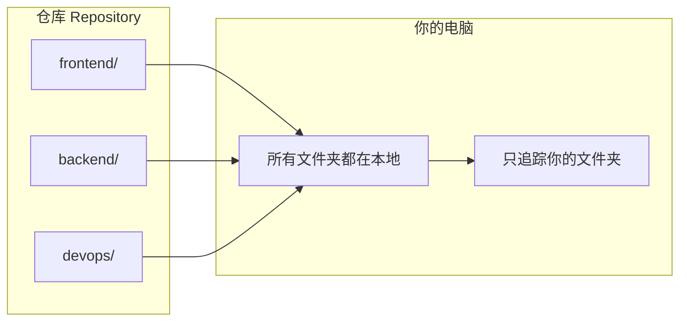
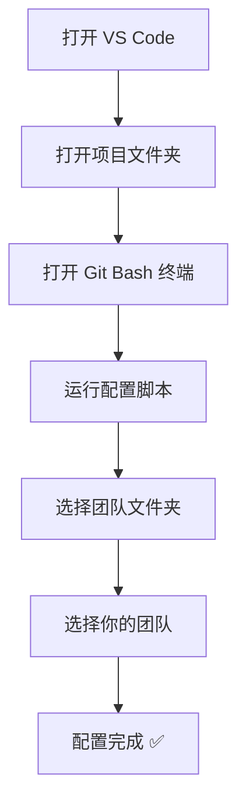
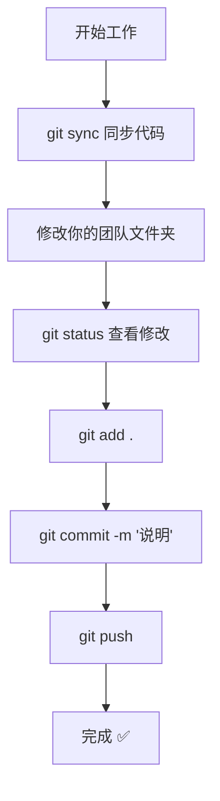
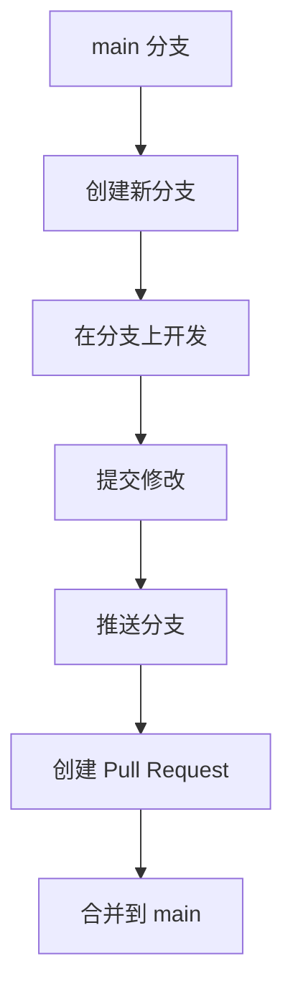

# 多团队协作教程 | Multi-Team Collaboration Tutorial

> 一个仓库，多个团队，各管各的文件夹

---

## 目录

1. [概述](#1-概述-overview)
2. [快速开始](#2-快速开始-quick-start)
3. [前提条件](#3-前提条件-prerequisites)
4. [初次配置](#4-初次配置-first-time-setup)
5. [日常操作](#5-日常操作-daily-workflow)
6. [分支操作](#6-分支操作-working-with-branches)
7. [特殊情况处理](#7-特殊情况处理-special-cases)
8. [命令速查表](#8-命令速查表-command-cheat-sheet)
9. [常见问题 FAQ](#9-常见问题-faq)
10. [遇到问题？](#10-遇到问题-troubleshooting)

---

## 1. 概述 (Overview)

### 这是什么？

这个项目让多个团队可以在**同一个仓库**中工作，每个团队只负责自己的文件夹：

- ✅ **所有文件都能看到** - 你可以查看、学习其他团队的代码
- ✅ **只提交自己的修改** - Git 只追踪你团队文件夹的改动
- ✅ **不会误提交** - 即使你改了其他团队的文件，也不会被提交
- ✅ **自动同步** - 一个命令就能拉取所有团队的最新代码

### 工作原理



**简单说**：你能看到所有代码，但 Git 只关心你负责的那个文件夹。

---

## 2. 快速开始 (Quick Start)

> 给有 Git 经验的人

### 3 步上手

```bash
# 1. 运行配置脚本，选择你的团队
bash scripts/setup-team-tracking.sh

# 2. 同步最新代码
git sync

# 3. 正常工作：修改 → 提交 → 推送
git add .
git commit -m "你的修改说明"
git push
```

### 命令速查

| 操作 | 命令 |
|------|------|
| 同步代码 | `git sync` |
| 切换分支 | `git switch-branch <分支名>` |
| 重新配置 | `bash scripts/setup-team-tracking.sh` |

---

## 3. 前提条件 (Prerequisites)

在开始之前，请确保：

- ✅ 已安装 Git
- ✅ 已下载仓库到本地

### 在 VS Code 中打开 Git Bash 终端

本教程中的所有命令都需要在 **Git Bash** 终端中运行（不是 PowerShell 或 CMD）。

**操作步骤**：

1. 打开 VS Code 底部的终端面板（快捷键：`` Ctrl + ` ``）
2. 点击终端右上角的下拉箭头 `∨`
3. 选择 **Git Bash**

`[截图: VS Code 终端下拉菜单，选择 Git Bash]`

---

## 4. 初次配置 (First Time Setup)

### 第一步：用 VS Code 打开项目文件夹

菜单：**文件 → 打开文件夹**，选择你下载的项目文件夹。

`[截图: VS Code 文件菜单 → 打开文件夹]`

### 第二步：打开 Git Bash 终端

按 `` Ctrl + ` `` 打开终端，确保选择的是 **Git Bash**。

`[截图: VS Code 终端已切换到 Git Bash]`

### 第三步：运行配置脚本

在终端中输入以下命令并按回车：

```bash
bash scripts/setup-team-tracking.sh
```

你会看到类似这样的输出：

`[截图: 脚本运行后显示的欢迎信息和团队文件夹列表]`

### 第四步：选择团队文件夹

脚本会显示所有可选的文件夹。输入你们团队需要管理的文件夹编号（用空格分隔），然后按回车。

例如输入 `1 2 3` 表示选择前三个文件夹作为团队文件夹。

`[截图: 输入团队文件夹编号]`

### 第五步：选择你的团队

接下来选择**你自己负责的**那个文件夹编号：

`[截图: 选择自己团队的界面]`

### 第六步：配置完成

看到 **✅ 配置完成！** 就说明成功了：

`[截图: 配置完成的输出信息]`

### 验证配置

运行以下命令验证配置是否生效：

```bash
git status
```

你应该只能看到你团队文件夹中的修改（如果有的话）。

### 配置流程图



---

## 5. 日常操作 (Daily Workflow)

### 5.1 开始工作前：同步最新代码

每次开始工作前，先拉取最新代码：

```bash
git sync
```

`[截图: git sync 执行成功的输出]`

**为什么用 `git sync` 而不是 `git pull`？**

`git sync` 是我们自定义的命令，它会：
1. 自动处理其他团队文件夹的更新
2. 避免冲突
3. 然后拉取最新代码

如果你用 `git pull`，在某些情况下可能会遇到冲突。所以**推荐始终使用 `git sync`**。

### 5.2 修改文件

在**你的团队文件夹**里修改文件，就像平常一样。

> 💡 你可以查看其他团队的文件，甚至临时修改它们进行测试。但这些修改不会被 Git 追踪，所以不用担心。

### 5.3 查看修改状态

查看你做了哪些修改：

```bash
git status
```

`[截图: git status 只显示自己团队文件夹的修改]`

注意：**只有你团队文件夹里的修改会显示出来**。

### 5.4 提交并推送修改

```bash
# 1. 添加所有修改到暂存区
git add .

# 2. 提交修改（写清楚你改了什么）
git commit -m "添加了用户登录功能"

# 3. 推送到远程仓库
git push
```

`[截图: 完整的 git add/commit/push 流程输出]`

**提交信息怎么写？**

写清楚你这次改动做了什么，例如：
- `添加了用户登录功能`
- `修复了首页加载缓慢的问题`
- `更新了配置文件`

### 5.5 日常工作流程图



---

## 6. 分支操作 (Working with Branches)

### 什么时候需要用分支？

当你要开发一个新功能或修复一个 bug 时，建议创建一个新分支，这样不会影响主分支（main）的代码。

### 创建功能分支

```bash
git checkout -b feature/新功能名称
```

例如：
```bash
git checkout -b feature/user-login
```

### 在分支上工作

正常修改、提交即可，流程和之前一样。

### 切换分支

使用我们的自定义命令（会自动处理其他团队的文件）：

```bash
git switch-branch main
```

或者切换到其他分支：
```bash
git switch-branch feature/user-login
```

### 推送分支到远程

第一次推送新分支时：

```bash
git push -u origin feature/user-login
```

之后就可以直接用 `git push`。

### 分支工作流程图



---

## 7. 特殊情况处理 (Special Cases)

| 情况 | 怎么办 |
|------|--------|
| 🤔 不小心修改了其他团队的文件 | **不用担心！** Git 不会追踪这些修改，也不会被提交。 |
| ⚠️ 遇到冲突 | 使用 `git sync` 而不是 `git pull`，会自动处理。 |
| 👀 想看其他团队的最新代码 | `git sync` 会拉取所有团队的更新，你可以查看。 |
| 🔄 想重新选择团队 | 重新运行 `bash scripts/setup-team-tracking.sh`。 |
| 👋 新同事加入 | 让他们运行配置脚本选择自己的团队即可。 |

---

## 8. 命令速查表 (Command Cheat Sheet)

| 你想做什么 | 命令 |
|-----------|------|
| 同步最新代码 | `git sync` |
| 查看修改状态 | `git status` |
| 添加修改 | `git add .` |
| 提交修改 | `git commit -m "说明"` |
| 推送到远程 | `git push` |
| 切换分支 | `git switch-branch <分支名>` |
| 创建新分支 | `git checkout -b <分支名>` |
| 重新配置团队 | `bash scripts/setup-team-tracking.sh` |

---

## 9. 常见问题 FAQ

### Q: 我能看到其他团队的文件吗？

**A:** 可以！所有文件都在你的电脑上，你可以随时查看、学习其他团队的代码。

### Q: 我修改了其他团队的文件会怎样？

**A:** 没关系。这些修改不会出现在 `git status` 中，也不会被提交。你可以放心地临时修改其他文件进行测试。

### Q: git sync 和 git pull 有什么区别？

**A:**
- `git sync`：我们自定义的命令，会自动处理其他团队文件夹，**不会产生冲突**
- `git pull`：Git 原生命令，如果你意外修改了其他团队的文件，**可能会产生冲突**

**建议始终使用 `git sync`。**

### Q: 每次 git sync 后都要重新配置吗？

**A:** 不需要！配置脚本只需要运行一次。之后每次 `git sync` 会自动保持你的配置。

### Q: 新同事加入怎么配置？

**A:** 新同事只需要：
1. 下载仓库到本地
2. 运行 `bash scripts/setup-team-tracking.sh`
3. 选择自己的团队

就可以开始工作了。

---

## 10. 遇到问题？ (Troubleshooting)

### 错误：`未找到团队配置`

**原因**：你还没有运行过配置脚本。

**解决**：运行配置脚本：
```bash
bash scripts/setup-team-tracking.sh
```

### 错误：`合并冲突`

**原因**：你可能使用了 `git pull` 而不是 `git sync`。

**解决**：下次使用 `git sync` 来同步代码。如果已经发生冲突，联系管理员协助处理。

### 错误：`git sync 不是命令`

**原因**：配置脚本没有正确安装 git 别名。

**解决**：重新运行配置脚本：
```bash
bash scripts/setup-team-tracking.sh
```

### 什么都不行了怎么办？

联系项目管理员寻求帮助。

---

## 需要提供的截图清单

请将以下截图替换文档中的 `[截图: ...]` 占位符：

1. **VS Code 终端下拉菜单选择 Git Bash** - 显示如何切换到 Git Bash
2. **VS Code 文件菜单 → 打开文件夹** - 显示如何打开项目
3. **配置脚本：欢迎信息和团队文件夹列表** - 脚本运行后的初始界面
4. **配置脚本：输入团队文件夹编号** - 选择哪些是团队文件夹
5. **配置脚本：选择自己的团队** - 选择你负责的文件夹
6. **配置脚本：配置完成输出** - 显示配置成功
7. **git sync 执行成功** - 同步命令的输出
8. **git status 只显示自己团队修改** - 状态命令的输出
9. **git add/commit/push 完整流程** - 提交流程的输出
